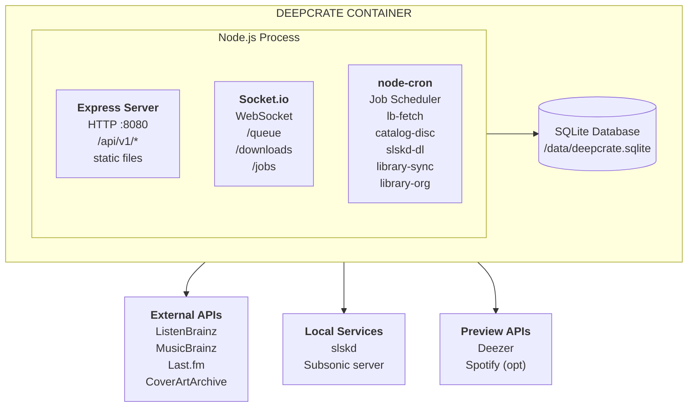
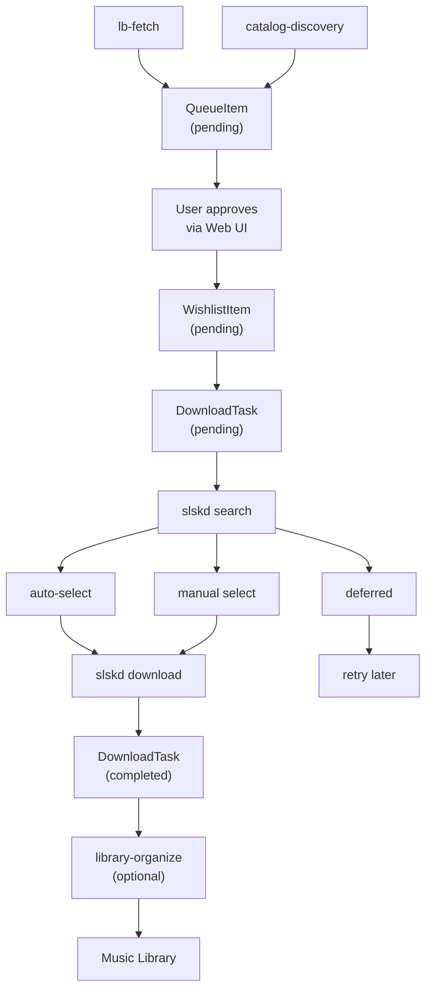
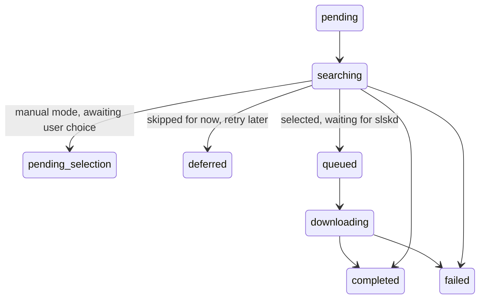

# DeepCrate Architecture

## Overview

DeepCrate is a music discovery and download pipeline built as a Node.js/TypeScript monorepo. The server runs Express with Socket.io and node-cron for background job scheduling. The UI is a Vue 3 single-page application served as static files in production. All state is stored in a single SQLite database via Sequelize 7. The entire application runs in a single Docker container.

## System Architecture



## Server (`/server/src`)

### Entry Point

`server.ts` runs the startup sequence:

1. Initialize database (authenticate, run schema migrations, sync models)
2. Run data migrations (JSON->SQLite, wishlist->DB: one-time on upgrade)
3. Create HTTP server and initialize Socket.io
4. Start listening on `HOST:PORT` (default `0.0.0.0:8080`)
5. Start background jobs via node-cron
6. Start download progress sync (polls slskd every 3s)

Graceful shutdown handles `SIGTERM`/`SIGINT`: closes Socket.io, HTTP server, stops jobs, closes DB.

### Express App

`plugins/app.ts` sets up the middleware chain:

```
Request
  -> CORS
  -> JSON body parser
  -> Public routes (/api/v1/health, /api/v1/auth/info)
  -> Auth middleware (all /api/* routes)
  -> API routes (/api/v1/{auth,queue,jobs,search,wishlist,downloads,library,preview,settings})
  -> Static file serving (production only, SPA fallback to index.html)
```

### Configuration

`config/settings.ts` loads configuration with this precedence:

1. Default values (`config/schemas.ts`)
2. YAML config file (resolved: `CONFIG_PATH` env -> `/config/config.yaml` -> `./config.yaml`)
3. `DEEPCRATE_*` environment variables (`__` for nesting, e.g. `DEEPCRATE_SLSKD__HOST`)

Config is validated with Zod schemas (`config/schemas.ts`). Invalid config causes a startup error with detailed messages.

See [configuration.md](configuration.md) for the full reference.

### Database

SQLite via [Sequelize 7](https://github.com/sequelize/sequelize). DB file at `$DEEPCRATE_DB_FILE` (default `$DATA_PATH/deepcrate.sqlite`).

- **Write mutex** (`config/db/mutex.ts`): serializes write operations to avoid SQLite lock contention
- **Schema migrations** (`scripts/schema-migrations.ts`): runs before model sync to add columns that indexes depend on
- **Model sync**: creates tables and indexes from model definitions

### Models

| Model | Source | Purpose |
|-------|--------|---------|
| `QueueItem` | `models/QueueItem.ts` | Music recommendations waiting for approval/rejection |
| `ProcessedRecording` | `models/ProcessedRecording.ts` | Tracks processed MBIDs to prevent duplicate recommendations |
| `CatalogArtist` | `models/CatalogArtist.ts` | Cached library artists for catalog-based discovery |
| `DiscoveredArtist` | `models/DiscoveredArtist.ts` | Prevents catalog discovery from re-recommending artists |
| `WishlistItem` | `models/WishlistItem.ts` | Items awaiting download or already processed |
| `DownloadTask` | `models/DownloadTask.ts` | Tracks download lifecycle from wishlist through slskd to completion |
| `LibraryAlbum` | `models/LibraryAlbum.ts` | Cached library albums for duplicate detection |

### Authentication

`middleware/auth.ts` supports three modes:

| Mode | Mechanism | Header |
|------|-----------|--------|
| `basic` | Username + password | `Authorization: Basic <credentials>` |
| `api_key` | API key | `Authorization: Bearer <key>` or `X-API-Key: <key>` |
| `proxy` | Reverse proxy (Authelia, etc.) | `Remote-User` header |

All credential comparisons use `crypto.timingSafeEqual` to prevent timing attacks. When auth is disabled, all requests pass through.

See [authelia-integration.md](authelia-integration.md) for proxy auth setup.

### Background Jobs

`plugins/jobs.ts` schedules jobs via node-cron. Intervals are configured through environment variables and converted to cron expressions.

| Job | Default Interval | Source | Purpose |
|-----|-----------------|--------|---------|
| `lb-fetch` | 6 hours | `jobs/listenbrainzFetch.ts` | Fetch recommendations from ListenBrainz |
| `catalog-discovery` | 7 days | `jobs/catalogDiscovery.ts` | Find similar artists via Last.fm/ListenBrainz |
| `slskd-downloader` | 1 hour | `jobs/slskdDownloader.ts` | Process wishlist items through slskd |
| `library-sync` | 24 hours | `jobs/librarySync.ts` | Sync library from Subsonic server for duplicate detection |
| `library-organize` | Manual | `jobs/libraryOrganize.ts` | Move completed downloads into music library |

**Overlap prevention:** Each job tracks a `running` flag; if a job is still running when its next scheduled execution fires, the execution is skipped.

**Cancellation:** Jobs check an `aborted` flag during execution. Cancellation is requested via the API and the job stops at its next checkpoint.

**Startup execution:** When `RUN_JOBS_ON_STARTUP=true` (default), all scheduled jobs run once immediately on server start.

All job lifecycle events are emitted via Socket.io (see [Real-time Events](#real-time-events-socketio)).

### Services

Business logic lives in `services/`:

| Service | Purpose |
|---------|---------|
| `QueueService` | Queue item CRUD, approval/rejection workflow |
| `WishlistService` | Wishlist management, import/export |
| `DownloadService` | Download task lifecycle, search, selection, progress sync |
| `LibraryService` | Library sync, duplicate detection |
| `LibraryOrganizeService` | Move downloads to library, optional beets integration |
| `PreviewService` | 30 second audio previews via Deezer/Spotify |
| `TrackCountService` | Resolve expected track counts from MusicBrainz/Deezer |
| `SearchQueryBuilder` | Build and transform slskd search queries |
| `AlbumTrackSelector` | Select best album match from search results |

**Download sub-services** (`services/downloads/`): scoring, quality filtering, path resolution, transfer sync.

**Similarity providers** (`services/providers/`): `LastFmSimilarityProvider` and `ListenBrainzSimilarityProvider`, pluggable providers for catalog discovery.

**External API clients** (`services/clients/`): `ListenBrainzClient`, `MusicBrainzClient`, `LastFmClient`, `CoverArtArchiveClient`, `SlskdClient`, `SubsonicClient`, `DeezerClient`, `SpotifyClient`.

## Real-time Events (Socket.io)

`plugins/io/` initializes Socket.io on the same HTTP server. Each namespace applies auth middleware that reuses the same credential validation as the REST API.

### `/queue` Namespace

| Event | Payload | Description |
|-------|---------|-------------|
| `queue:item:added` | `{ item }` | New item added to the approval queue |
| `queue:item:updated` | `{ mbid, status, processedAt }` | Item approved or rejected |
| `queue:stats:updated` | `{ pending, approved, rejected, inLibrary }` | Queue counts changed |

### `/downloads` Namespace

| Event | Payload | Description |
|-------|---------|-------------|
| `download:task:created` | `{ task }` | New download task created from wishlist |
| `download:task:updated` | `{ id, status, slskdUsername?, fileCount?, errorMessage? }` | Task status changed |
| `download:progress` | `{ id, progress }` | Download progress update (throttled to every 2s per task) |
| `download:stats:updated` | `{ pending, searching, downloading, completed, failed, ... }` | Download counts changed |
| `download:pending_selection` | `{ id, artist, album, resultCount, selectionExpiresAt }` | Manual selection required |
| `download:selection_expired` | `{ id, artist, album }` | Selection timed out |

### `/jobs` Namespace

| Event | Payload | Description |
|-------|---------|-------------|
| `job:started` | `{ name, startedAt }` | Job began execution |
| `job:progress` | `{ name, message, current?, total? }` | Job progress update |
| `job:completed` | `{ name, duration, stats? }` | Job finished successfully |
| `job:failed` | `{ name, error, duration }` | Job failed with error |
| `job:cancelled` | `{ name }` | Job was cancelled by user |

### Progress Sync

`plugins/progressSync.ts` polls slskd every 3 seconds for active download progress and emits `download:progress` events to connected clients.

## UI (`/ui/src`)

**Stack:** Vue 3 + TypeScript + Pinia + PrimeVue 4 + Vite

### Router

Routes are defined in `router/routes.ts` with an auth guard in `router/index.ts`:

| Path | Page | Auth |
|------|------|------|
| `/login` | LoginPage | Guest only |
| `/dashboard` | DashboardPage | Required |
| `/queue` | QueuePage | Required |
| `/wishlist` | WishlistPage | Required |
| `/downloads` | DownloadsPage | Required |
| `/library` | LibraryPage | Required |
| `/settings` | SettingsPage | Required |

The auth guard checks `authStore.isAuthenticated` before each navigation. For proxy/disabled auth modes, users are treated as always authenticated.

### Stores (Pinia)

| Store | Purpose |
|-------|---------|
| `auth` | Authentication state, login/logout, auth config |
| `queue` | Queue items, filtering, approval/rejection |
| `wishlist` | Wishlist items, import/export |
| `downloads` | Download tasks, search results, selection |
| `jobs` | Job status, manual triggers, cancellation |
| `library` | Library stats, album duplicate checking |
| `player` | Audio preview playback state |
| `settings` | App configuration, settings updates |
| `theme` | Dark/light mode, theme preferences |

### Composables

Composables follow two patterns:

- **Store wrappers** (`useQueue`, `useAuth`, `useDownloads`, etc.): Provide convenient access to Pinia stores from page components. Do not duplicate state.
- **Socket composables** (`useQueueSocket`, `useDownloadsSocket`, `useJobsSocket`, `useWishlistSocket`): Manage Socket.io connections with ref subscriptions via `useSocketConnection`. Multiple components can subscribe to the same namespace; the connection is opened on first subscriber and closed when the last unsubscribes.
- **Utility composables** (`useToast`, `useStats`, `useBreakpoint`, `useKeyboardShortcuts`, `useTabSync`, `useSidebarItems`): Reusable UI logic.

### Services

`services/api.ts` provides an Axios client with:
- Auth interceptor (attaches credentials from the auth store)
- 503 retry with exponential backoff for transient service unavailability

Feature specific API modules (`services/queue.ts`, etc.) build on this base client.

### Theme

Custom PrimeVue Aura preset (`assets/styles/theme.ts`) with indigo primary colors and dark mode surface palette.

## Data Flow



### Download Task Status Lifecycle



## Security Model

### Built-in Authentication

Three modes configurable via `ui.auth.type` in config:

1. **HTTP Basic Auth**: Username/Password
2. **API Key Auth**: Bearer token or `X-API-Key` header
3. **Proxy Auth**: Delegates to reverse proxy (Authelia, etc.), reads `Remote-User` header

Socket.io connections use the same auth logic via a dedicated middleware (`plugins/io/authMiddleware.ts`).

### Proxy Auth Flow

```
Client -> Reverse Proxy (Caddy/nginx/Traefik) -> Authelia (verify) -> DeepCrate
```

See [authelia-integration.md](authelia-integration.md) for configuration examples.

## Deployment

### Resource Requirements

| Resource | Minimum | Recommended |
|----------|---------|-------------|
| CPU | 1 core | 2 cores |
| RAM | 256 MB | 512 MB |
| Storage | 100 MB | 500 MB (for logs) |
| Network | Required | Required |

The container is middleweight: Most resource usage comes from API calls to external services.
- Future work to minimize the size of the container and provide a headless mode.

### Scalability

DeepCrate is designed for single-user/household use. It is **not** designed for:
- Multi-tenant deployments (_yet_)
- Horizontal scaling
- High-availability

For larger deployments, consider running multiple instances with separate configs.

### Logging

Winston logger with configurable transports:

- **Console** (stdout/stderr): Enabled by default (`LOG_TO_CONSOLE=true`)
- **File**: Optional (`LOG_TO_FILE=true`), writes `combined.log` and `error.log` to `$LOG_DIR` (default `$DATA_PATH`)

Log level is controlled via `LOG_LEVEL` (default: `info` in development and production).

```bash
docker logs deepcrate        # View logs
docker logs -f deepcrate     # Follow logs
```

### Failure Handling

| Failure | Behavior |
|---------|----------|
| External API request fails | Logged, continues to next item |
| Background job fails | Error emitted via Socket.io, job stops, retries on next scheduled run |
| Container restart | Server re-initializes, state preserved in SQLite, jobs resume on schedule |
| slskd unreachable | Downloads skip, progress sync logs error, retry next run |
| Subsonic server unreachable | Catalog discovery/library sync skip run |
| Database write conflict | Write mutex serializes operations, prevents SQLite lock errors |
